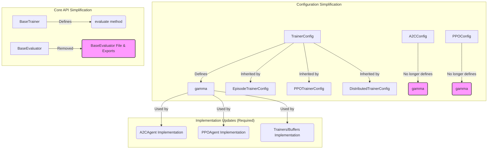

# Refactoring Plan for `reinforce` Module

This plan outlines steps to simplify the `reinforce` Python module by removing unused components and consolidating redundant configurations, without reducing functionality.

## Summary of Findings

1.  **Well-Structured Core:** The module has a clear separation of concerns (`agents`, `configs`, `core`, `environments`, etc.). Core interfaces (`BaseAgent`, `BaseEnvironment`, `BaseTrainer`) are standard.
2.  **Unused Core Component:** `BaseEvaluator` is defined but not used; evaluation is handled within `Trainer` classes.
3.  **Robust Configuration:** Pydantic models (`ConfigManager`, `ExperimentConfig`, etc.) provide type safety and validation. Discriminated unions handle agent/trainer variations well.
4.  **Configuration Redundancy:** `discount_factor` (gamma) is defined in both `TrainerConfig` and agent-specific configs (`A2CConfig`, `PPOConfig`).

## Proposed Simplification Steps

1.  **Remove `BaseEvaluator`:**
    *   Delete the file `reinforce/core/base_evaluator.py`.
    *   Remove the import and export of `BaseEvaluator` from `reinforce/core/__init__.py`.
    *   *Benefit:* Simplifies the core API by removing an unused component.
2.  **Consolidate `discount_factor` (gamma):**
    *   Remove the `discount_factor` field from `reinforce/configs/models/agent/a2c_config.py`.
    *   Remove the `discount_factor` field (and its alias `gamma`) from `reinforce/configs/models/agent/ppo_config.py`.
    *   Keep the `gamma` field solely within `reinforce/configs/models/trainer/trainer_config.py` as the single source of truth.
    *   *Benefit:* Reduces configuration complexity and potential inconsistencies.
    *   **Note:** Requires subsequent implementation changes in agents/trainers/buffers to use the consolidated `gamma` from the trainer config.

## Visual Plan (Mermaid Diagram)

